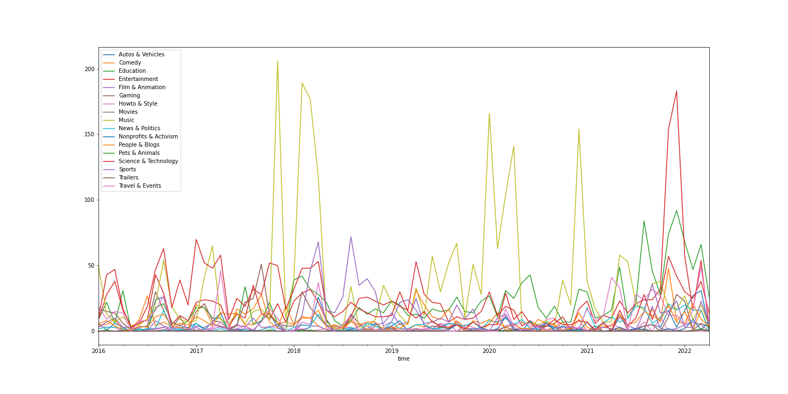

# yt-watch-history-analytics
### Made this to visualize my YouTube watch history

I wanted to see what categories of videos i was watching most of the times

### Steps

 1. Download YouTube data from https://takeout.google.com/
 2. Setup Youtube Data V3 api , https://developers.google.com/youtube/v3/docs/videos
	 - might have to setup and enable google cloud api see https://developers.google.com/youtube/v3/quickstart/python
	 - export credentials as json
3. Run script
	-  the script gets the categoryId for each video in the export using youtube api, list videos, snippets api
	  - gets names of each categoryId from youtube category api
4. Finally the script plots count of each category grouped by month

